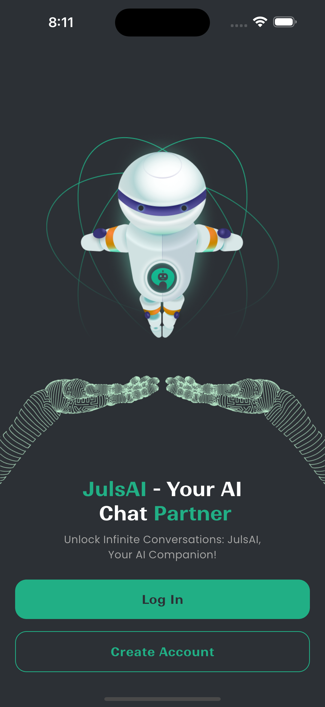
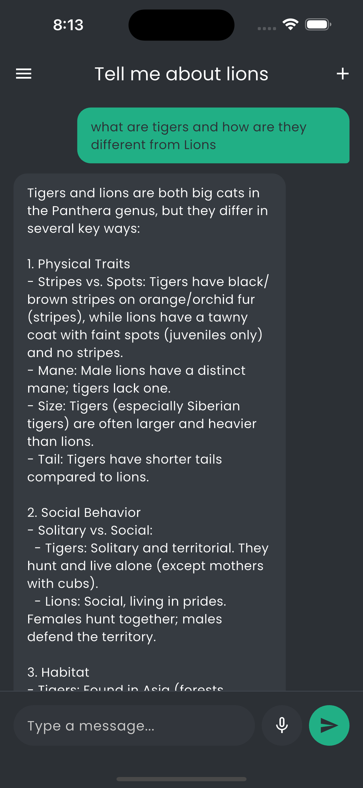
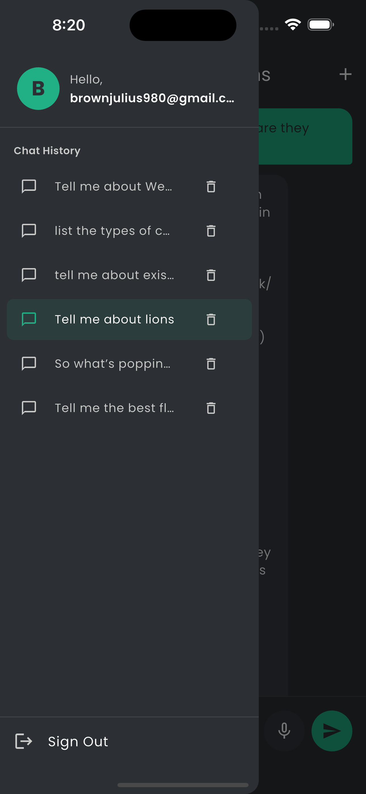

# AI Chat App

A beautiful Flutter AI chat application with voice support, powered by Groq/OpenAI and Supabase.

## Features

- 🤖 **AI Conversations**: Chat with Groq (free) or OpenAI's GPT-3.5 Turbo
- 🎤 **Voice Input**: Speak your messages using speech-to-text
- 🔊 **Voice Output**: Listen to AI responses with text-to-speech
- 💬 **Chat History**: View and manage your conversation history
- 🔐 **Authentication**: Secure email/password authentication with Supabase
- 🎨 **Beautiful UI**: Clean, modern interface with dark theme
- 📱 **Real-time Streaming**: See AI responses as they're generated
- 🔄 **Flexible AI Providers**: Easy switching between Groq and OpenAI

## Screenshots

<p align="center">
  
  
</p>

<p align="center">
  
  
</p>

## Tech Stack

- **Frontend**: Flutter
- **State Management**: Riverpod (with code generation)
- **Backend**: Supabase (Authentication & Database)
- **AI Providers**:
  - Groq (Qwen 3 32B - Free)
  - OpenAI GPT-3.5 Turbo (Paid)
- **Voice**:
  - `speech_to_text` for voice input
  - `flutter_tts` for text-to-speech
- **Environment**: `flutter_dotenv` for secure API key management

## Prerequisites

- Flutter SDK (3.9.2 or higher)
- Dart SDK
- Supabase Account ([Sign up here](https://supabase.com))
- AI Provider API Key (choose one):
  - Groq API Key ([Get free key here](https://console.groq.com))
  - OpenAI API Key ([Get one here](https://platform.openai.com/api-keys))

## Setup Instructions

### 1. Clone the Repository

```bash
git clone https://github.com/jabguru/AI-Chat-App.git
cd AI-Chat-App
```

### 2. Install Dependencies

```bash
flutter pub get
```

### 3. Supabase Setup

#### Create Project

1. Go to [supabase.com](https://supabase.com) and sign in
2. Click "New Project"
3. Fill in your project details
4. Wait for the project to be created

#### Get API Credentials

1. In your Supabase project, go to **Settings** (gear icon)
2. Click **API** in the sidebar
3. Copy the following:
   - **Project URL** (looks like: `https://xxxxx.supabase.co`)
   - **anon/public** key (the `anon` key)

#### Setup Database

1. In your Supabase project, go to **SQL Editor**
2. Click **New Query**
3. Copy the entire content of `supabase_schema.sql` from this project
4. Paste it into the SQL editor
5. Click **Run** (or press Cmd/Ctrl + Enter)
6. You should see "Success. No rows returned" - that's good!

### 4. Configure Environment Variables

Create a `.env` file in the root of the project:

```env
SUPABASE_URL=your_supabase_url_here
SUPABASE_ANON_KEY=your_supabase_anon_key_here
OPENAI_API_KEY=your_openai_api_key_here
GROQ_API_KEY=your_groq_api_key_here
```

**Note**: You only need to fill in the API key for the AI provider you want to use. Leave the other blank.

### 5. Switch Between AI Providers (Optional)

By default, the app uses Groq (free). To switch to OpenAI:

1. Open `lib/shared/services/ai_service_factory.dart`
2. Change the `currentProvider` line:

```dart
// Use Groq (default)
static AIProvider currentProvider = AIProvider.groq;

// Or use OpenAI
static AIProvider currentProvider = AIProvider.openai;
```

### 6. iOS Specific Setup (for voice features)

Add the following to your `ios/Runner/Info.plist`:

```xml
<key>NSMicrophoneUsageDescription</key>
<string>This app needs access to the microphone for voice input.</string>
<key>NSSpeechRecognitionUsageDescription</key>
<string>This app needs access to speech recognition for voice input.</string>
```

### 7. Android Specific Setup (for voice features)

Add the following permissions to your `android/app/src/main/AndroidManifest.xml`:

```xml
<uses-permission android:name="android.permission.RECORD_AUDIO"/>
<uses-permission android:name="android.permission.INTERNET"/>
<uses-permission android:name="android.permission.BLUETOOTH"/>
<uses-permission android:name="android.permission.BLUETOOTH_ADMIN"/>
<uses-permission android:name="android.permission.BLUETOOTH_CONNECT"/>
```

Also add this inside the `<queries>` section (or create it if it doesn't exist):

```xml
<queries>
    <intent>
        <action android:name="android.intent.action.PROCESS_TEXT"/>
        <data android:mimeType="text/plain"/>
    </intent>
    <intent>
        <action android:name="android.speech.RecognitionService"/>
    </intent>
</queries>
```

**Note**: The Bluetooth permissions are required by the `speech_to_text` package for certain devices. The `RecognitionService` query is required for Android 11+ to discover speech recognition services.

### 8. Generate Riverpod Code

Run the code generator to generate Riverpod providers:

```bash
dart run build_runner build --delete-conflicting-outputs
```

### 9. Run the App

```bash
flutter run
```

## Usage

1. **Sign Up/Login**: Create an account or log in with your email and password
2. **Verify Email**: Check your email for verification link (required before chatting)
3. **Start Chatting**: Type a message or tap the microphone icon to speak
4. **Listen to Responses**: Tap the speaker icon on AI messages to hear them read aloud
5. **View History**: Open the drawer (tap the menu icon) to see all your chat sessions
6. **New Chat**: Tap the + icon in the app bar to start a new conversation
7. **Delete Chats**: Tap the delete icon next to any chat in the history drawer

## AI Provider Comparison

## AI Provider Comparison

| Feature   | Groq (Default) | OpenAI                     |
| --------- | -------------- | -------------------------- |
| Cost      | **Free**       | Paid (requires $5 minimum) |
| Model     | Qwen 3 32B     | GPT-3.5 Turbo              |
| Speed     | Very Fast      | Fast                       |
| Streaming | Simulated      | Real-time                  |
| Quality   | Excellent      | Excellent                  |

## Project Structure

```
lib/
├── core/
│   ├── config/
│   │   └── env_config.dart          # Environment configuration
│   ├── theme/
│   │   ├── colors.dart              # App colors
│   │   └── theme.dart               # Theme configuration
│   └── widgets/
│       └── ...                      # Reusable widgets
├── features/
│   ├── auth/
│   │   ├── data/
│   │   ├── presentation/
│   │   └── providers/               # Auth state management
│   └── chat/
│       ├── data/
│       │   └── models/              # Message & ChatSession models
│       ├── presentation/
│       │   └── chat_screen.dart     # Main chat UI
│       └── providers/
│           └── chat_provider.dart   # Chat state management
├── shared/
│   └── services/
│       ├── ai_service.dart          # AI service interface
│       ├── ai_service_factory.dart  # Provider switching logic
│       ├── openai_service.dart      # OpenAI implementation
│       ├── groq_service.dart        # Groq implementation
│       ├── supabase_service.dart    # Supabase integration
│       └── voice_service.dart       # Voice input/output
└── main.dart                        # App entry point
```

## How to Switch AI Providers

The app uses an abstraction layer that makes it easy to switch between AI providers:

### Option 1: Change Default Provider

Edit `lib/shared/services/ai_service_factory.dart`:

```dart
static AIProvider currentProvider = AIProvider.groq;  // or AIProvider.openai
```

### Option 2: Runtime Switching (Advanced)

You can programmatically switch providers:

```dart
AIServiceFactory.switchTo(AIProvider.openai);
// or
AIServiceFactory.switchTo(AIProvider.groq);
```

## Troubleshooting

### Email Verification Issues

- Check your spam folder for the verification email
- Make sure email confirmation is enabled in your Supabase project settings

### Voice Features Not Working

#### General Issues

- Ensure microphone permissions are granted in device settings
- Check that the correct permissions are added to Info.plist (iOS) or AndroidManifest.xml (Android)

#### Android Specific

- Make sure all Bluetooth permissions are added (required by speech_to_text package)
- Verify the `RecognitionService` query intent is added to AndroidManifest.xml (required for Android 11+)
- If speech recognition fails, try testing on a physical device instead of an emulator
- Check that Google app or other speech recognition service is installed and up-to-date
- **Text-to-Speech (TTS)**: If you don't hear any voice output on emulator:
  1. Open emulator's **Settings** > **System** > **Languages & input** > **Text-to-speech output**
  2. Select **Google Text-to-Speech Engine** as preferred engine
  3. Install voice data if prompted, or install "Google Text-to-Speech" from Play Store
  4. Restart your app after configuring TTS

#### iOS Specific

- Ensure both microphone and speech recognition permissions are in Info.plist
- **Text-to-Speech (TTS)**: If you don't hear any voice output, you need to download a voice:
  1. Open iOS **Settings** > **Accessibility** > **Spoken Content** > **Voices**
  2. Select **English** and download a voice (e.g., "Samantha" or "Alex")
  3. Restart your app after downloading the voice
- **Speech-to-Text (STT)**: Does **not work on iOS Simulator** - you must use a physical iPhone/iPad device
- For best results with voice features, always test on a physical device

### Build Runner Issues

If code generation fails, try:

```bash
flutter clean
flutter pub get
dart run build_runner clean
dart run build_runner build --delete-conflicting-outputs
```

### API Key Issues

- Make sure your `.env` file is in the project root
- Verify API keys are valid and have sufficient credits/quota
- Restart the app after changing `.env` file

## Contributing

Contributions are welcome! Please feel free to submit a Pull Request.

## License

This project is licensed under the MIT License - see the LICENSE file for details.

## Acknowledgments

- Design inspiration from [AI Chat Bot](https://www.figma.com/community/file/1369245876107831160)
- Groq for providing free, fast LLM inference
- Supabase for backend infrastructure
